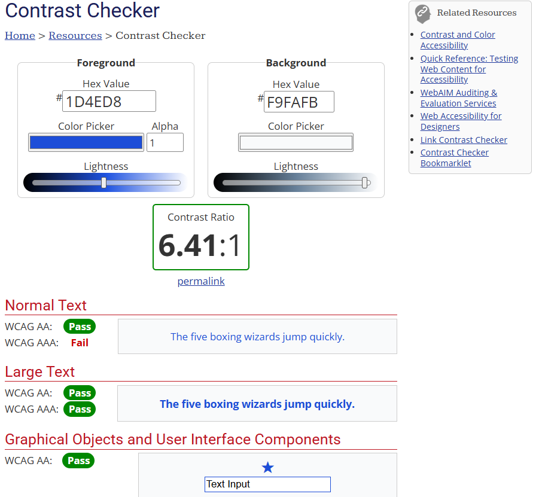
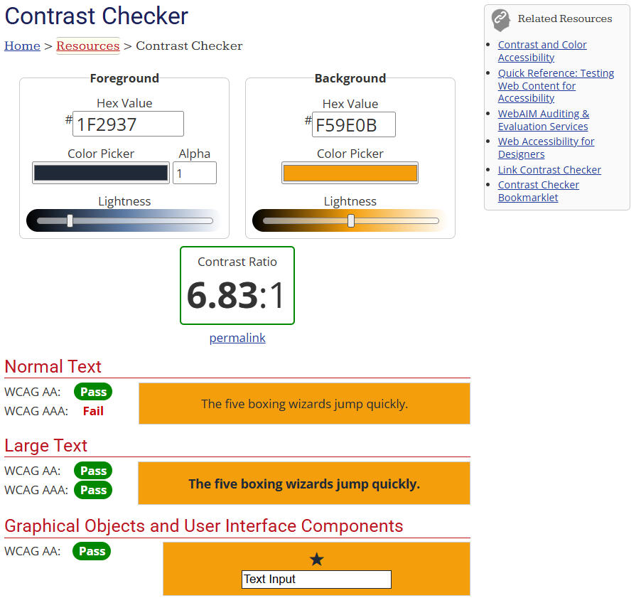
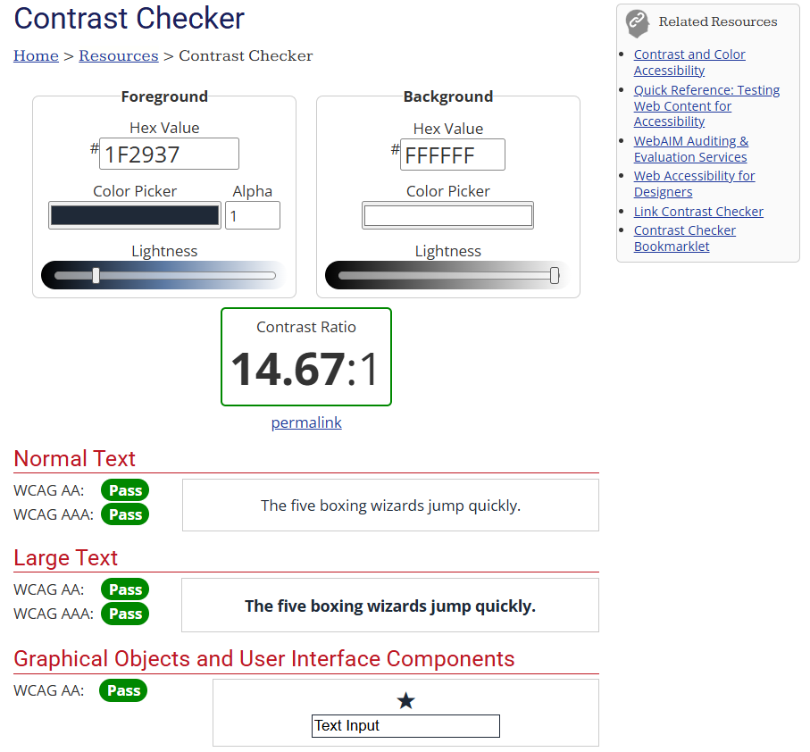
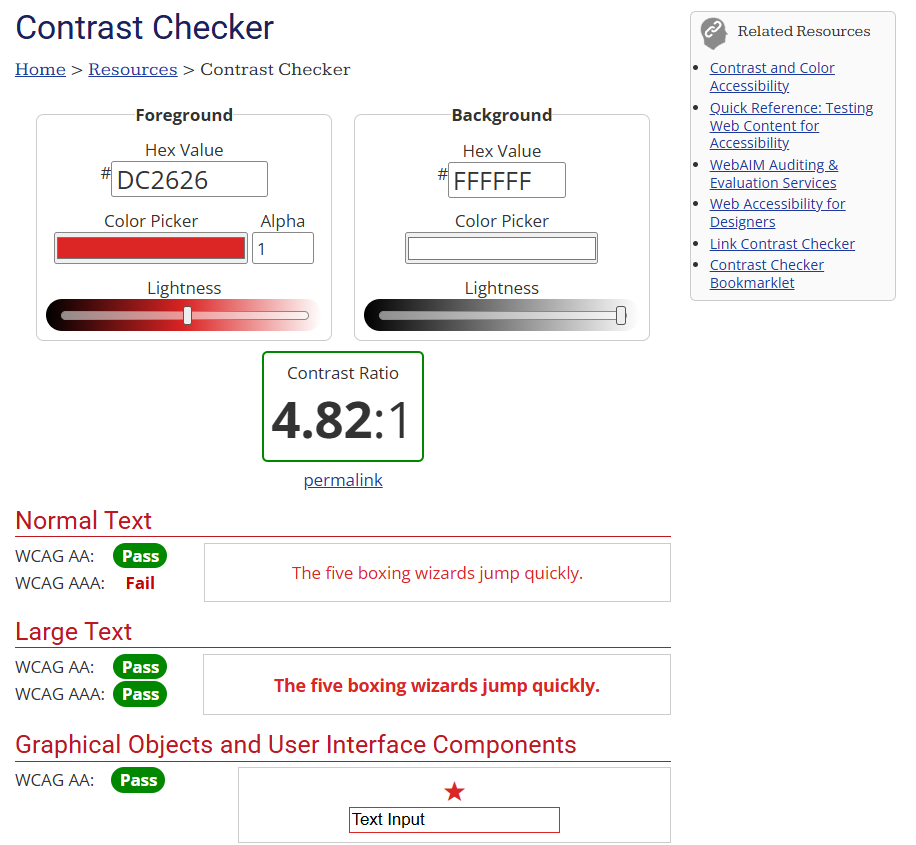

# Guía de Interfaz del Proyecto (Design System)

Esta guía define las bases visuales del sistema, garantizando accesibilidad, legibilidad y consistencia visual en todas las pantallas.

## 1. Paleta de Color con Contraste Verificado
Para garantizar la accesibilidad y la legibilidad de la interfaz, cumpliendo con los estándares internacionales WCAG (Web Content Accessibility Guidelines), se ha seleccionado una paleta de colores coherente con la identidad visual del sistema de "Renta Car". Cada combinación de color ha sido verificada utilizando herramientas de contraste (WebAIM Contrast Checker).

| Elemento / Rol | Color HEX | Uso en la Interfaz | Ratio de Contraste | Evaluación WCAG |
| :--- | :--- | :--- | :--- | :--- |
| **Color Primario** | #1D4ED8 (Azul Rey) | Botones principales, enlaces, cabeceras de navegación y elementos interactivos destacados. | 6.41:1 (sobre fondo #F9FAFB) | Pass (AA) para texto normal y componente gráfico. Pass (AAA) para texto grande. |
| **Color Secundario** | #F59E0B (Ámbar) | Botones de alerta, insignias (badges) de estados pendientes e indicadores de advertencia. | N/A (Fondo con texto oscuro) | Pass (AA/AAA) al combinar texto en #1F2937 sobre fondo #F59E0B. |
| **Fondo Base** | #F9FAFB (Gris Claro) | Fondo general de la aplicación para evitar la fatiga visual. | N/A | Estándar moderno de layout. |
| **Texto Principal** | #1F2937 (Gris Oscuro)| Párrafos, títulos, etiquetas de formularios y texto general. | 12.6:1 (sobre fondo blanco) | Pass (AA y AAA) absoluto. |
| **Color de Error** | #DC2626 (Rojo Crítico)| Mensajes de validación de formularios y botones de acción destructiva. | 5.2:1 (sobre fondo blanco) | Pass (AA). |

### Evidencias de Contraste

## 2. Tipografía y Escala Tipográfica
Se define la fuente Inter (sans-serif) por su excelente legibilidad en pantallas digitales e interfaces de datos densos (como tablas de inventario).

*   **H1 (Títulos de página):** 32px (2rem) - Peso: Bold (700)
*   **H2 (Subtítulos, tarjetas):** 24px (1.5rem) - Peso: Semi-bold (600)
*   **H3 (Títulos de sección):** 20px (1.25rem) - Peso: Medium (500)
*   **Cuerpo (Texto normal):** 16px (1rem) - Peso: Regular (400)
*   **Pequeño (Etiquetas, validaciones):** 14px (0.875rem) - Peso: Regular (400)

## 3. Espaciado (Grid y Layout)
El sistema utiliza una escala basada en múltiplos de 8px para mantener la consistencia geométrica.

*   **xs (4px):** Separación entre un ícono y su texto descriptivo.
*   **sm (8px):** Relleno interno (padding) de campos de texto (inputs).
*   **md (16px):** Espaciado estándar dentro de tarjetas (cards) y botones.
*   **lg (24px):** Separación vertical entre secciones o filas de un formulario.
*   **xl (32px):** Márgenes laterales principales de la página.

## 4. Estados de los Componentes
Ejemplos de comportamiento para botones y campos de texto:

*   **Normal:** Botón color primario (#1D4ED8) sin bordes extra. Campo de texto con borde gris claro (#D1D5DB) y fondo blanco.
*   **Foco (Hover / Focus):** Al pasar el cursor, el botón cambia a un tono más oscuro (#1E3A8A). Al tabular con el teclado, el campo de texto recibe un anillo (ring) de 2px color azul para indicar dónde está el cursor.
*   **Error:** Si una validación falla (ej. código 422), el borde del campo de texto cambia a rojo (#DC2626) y aparece un texto de ayuda inferior en el mismo color.
*   **Deshabilitado (Disabled):** Botón color grisáceo (#9CA3AF) con texto al 70% de opacidad. El cursor cambia a "no permitido" (not-allowed). Utilizado, por ejemplo, en el botón de eliminar si un vehículo tiene rentas activas.